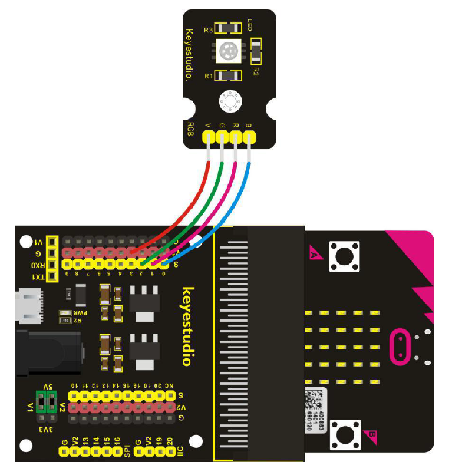

# RGB LED - Howto

## Überblick

<!--- kurze Einführung -->

RGB (red green blue) LED ermöglichen es uns verschiedene Farben darzustellen. 
Jede Farbe ist einem pin zugeordnet und kann so über analoge Werte definiert werden. 


---

## Verkabelung (Abweichung vom Sensor)

<!--- Bild und Quellenangabe der Verkablung -->



Abb.: [Handbuch KS0365 Sensor Kit](../material/keystudio/KS0361(KS0365)%20Microbit%20V2.0%20Sensor%20Learning%20Kit.pdf) S. 125

---

## Code

<!--- code Beispiel: kann später von Github copy & pasted werden  -->

```python
from microbit import pin0, pin1, pin2, sleep

""" 
Vorsicht Verkablung in Abb stimmt nicht mit Reihenfolge auf Sensor überein
B und G sind vertauscht

Sensor ist wie folgt in dem Code angeschlossen 
von links nach rechts
- V - V1
- B - pin2
- R - pin1
- G - pin0
"""

pin2.write_analog(0)
pin1.write_analog(0)
pin0.write_analog(0)

while True:
    pin1.write_analog(1023)
    sleep(2000)
    pin1.write_analog(1023)
    pin2.write_analog(1023)
    sleep(2000)
    pin2.write_analog(0)
    pin0.write_analog(1023)
    sleep(2000)
    pin0.write_analog(0)

```

---

## Mögliche Probleme

<!--- Wenn Probleme bekannt sind bitte hier aufführen -->

Beschriftung Abb und Sensor stimmen nicht überein - probieren

---

## Quellen 

<!--- Bitte alle Quellen angeben -->

Abb.: [Handbuch KS0365 Sensor Kit](../material/keystudio/KS0361(KS0365)%20Microbit%20V2.0%20Sensor%20Learning%20Kit.pdf) S. 125