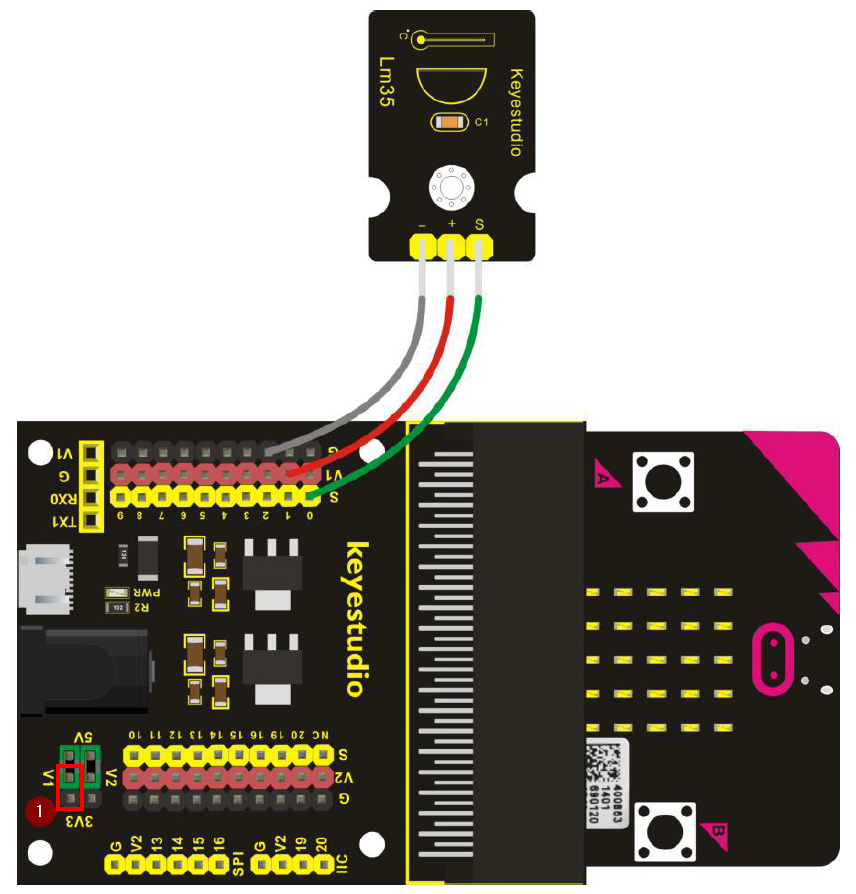

# Umgebungstemperatur - Howto

## Überblick
- Typ: LM35
- es handelt sich um einen analogen Sensor
- Die Werte sind linear und müssen in C° umgerechnet werden 
- 0,01V pro C° 

> Formel: temp = 300 * value / 1023 


- temp: die errechnete Temperatur
- 300: Spannungsversorgung Microbit 3V
- 1023: Wertebereich

<!--- kurze Einführung -->

---

## Verkabelung 

<!--- Bild und Quellenangabe der Verkabelung -->


Abb.: [Handbuch KS0365 Sensor Kit](../material/keystudio/KS0361(KS0365)%20Microbit%20V2.0%20Sensor%20Learning%20Kit.pdf) S. 187

---

## Code

<!--- code Beispiel: kann später von Github copy & pasted werden  -->

```python
import lcd1602_i2c
from microbit import pin0, sleep

# Zugriff auf LCD Display einrichten
l = lcd1602_i2c.LCD1620()

while True:
    # Analogen Wert von pin 0 auslesen
    value = pin0.read_analog()

    # Analogen Wert in Temperatur umrechnen
    temp = 300 * value / 1023

    # auf seriellen Monitor ausgeben
    print(temp)

    # Temperatur auf LCD Display ausgeben
    l.puts("temp: " + str(temp))

    # 1000 Millisekunden warten 
    sleep(1000)
```
---

## Mögliche Probleme

<!--- Wenn Probleme bekannt sind bitte hier aufführen -->
- **Falsche Werte**
  -  Formel falsch
     -  check nochmal Abschnitt Code
  - Spannungsjumper falsch 
    - muss auf 3V3 sein bei V1 
      - siehe Markierung 1 (roter Kasten) im Abschnitt: Verkabelung
 ---

## Quellen 

<!--- Bitte alle Quellen angeben -->

Abb.: [Handbuch KS0365 Sensor Kit](../material/keystudio/KS0361(KS0365)%20Microbit%20V2.0%20Sensor%20Learning%20Kit.pdf) S. 186 ff

[microbit python analog](https://microbit-micropython.readthedocs.io/en/latest/pin.html?highlight=analog#)